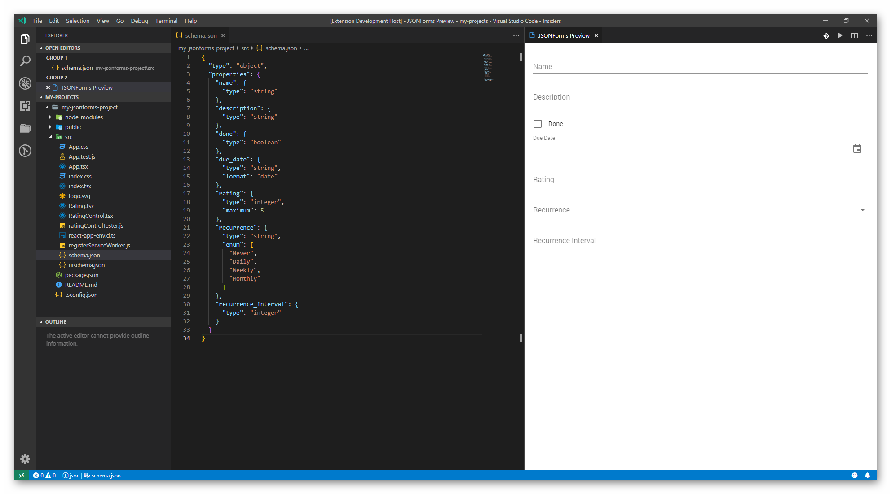

# JSONForms Tooling Visual Studio Code Extension

The VS extension brings you all the functions of the tooling to your Visual Studio Code. Within VS Code you can:

* Scaffold a seed project
* Generate your basic UI Schema from your Schema
* Preview the current schema files

## Get Started

1. First you need to follow the `Get Started` instructions within the README file in the root folder. 
2. After that open the `vscode-extension` folder within Visual Studio Code.
3. Now press F5 and wait for the debugger to get started. 
4. In the debugger window open any folder you want. 

## Scaffold a sample project
1. Right click on the folder, where you want to install the sample project.
2. Select the `JSONForms: Scaffold Seed Project` in the context menu.
3. Set a custom name for your project. You can also leave the field blank, then the project name will be `jsonforms-react-seed`
4. Select if you want to use a default schema or a custom schema.
5a. If you've selected the custom schema option, you now need to select the schema file on your PC.
5b. You can then right click on any empty folder and install the [seed](https://github.com/eclipsesource/jsonforms-react-seed) project inside it. This will clone the code from the repositories and run `npm install`
6. (Optional) You can also generate an UI Schema out of any valid JSON schema file by rightclicking on the schema file

## Generate a default UI schema
1. Right click on a `schema.json` file.
2. Select `JSONForms: Generate UI Schema`.
3. Enter a name for the ui schema file (default: `uischema.json`).

## Preview the schema and UI schema
1. Right click on a `schema.json` or a `uischema.json` file.
2. The editor will now ask you to select the other file (if you selected a schema file in the first step, now select the uischema file).
3. Now the preview will open in split screen and show you a preview of your schema files. (Note: It can take a while to load the environment)